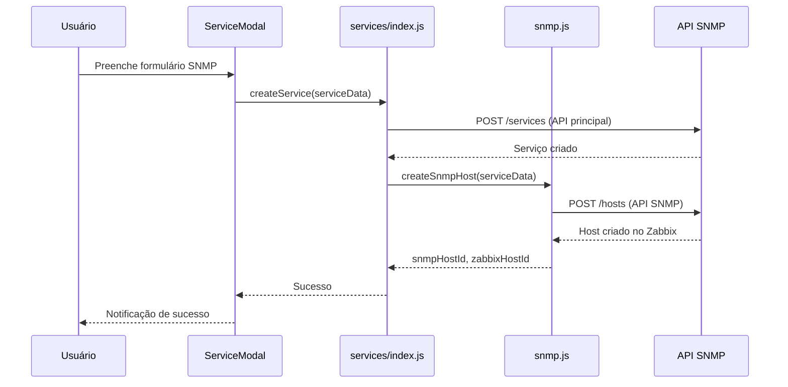
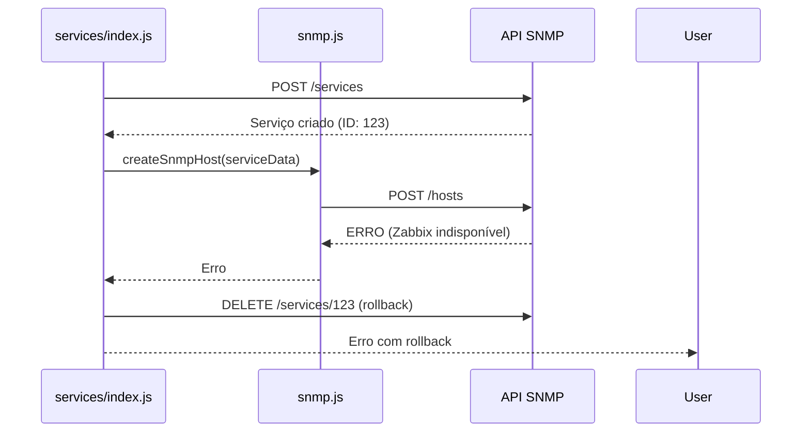

# Integração SNMP - Frontend

## Visão Geral

Este módulo implementa a integração completa entre o frontend React e a API SNMP dedicada, permitindo o cadastro, atualização e remoção de hosts SNMP com sincronização automática com o Zabbix Server.

## Arquitetura

### Componentes Principais

1. **API SNMP** (`src/api/services/snmp.js`)
   - Comunicação direta com a API SNMP (http://0.0.0.0:8001)
   - Mapeamento de dados entre frontend e backend
   - Tratamento de erros específicos

2. **Integração de Serviços** (`src/api/services/index.js`)
   - Orquestração entre API principal e API SNMP
   - Rollback automático em caso de falhas
   - Logs detalhados para debugging

3. **Formulário SNMP** (`src/admin_pages/internal_components/ServiceForms/SnmpServiceForm.jsx`)
   - Interface aprimorada com validações
   - Suporte para todas as versões SNMP (v1, v2c, v3)
   - Configurações de autenticação e privacidade

4. **Modal de Serviços** (`src/admin_pages/internal_components/ServiceModal.jsx`)
   - Notificações específicas para SNMP
   - Tratamento de erros customizado
   - Feedback visual para operações

## Funcionalidades

### ✅ Implementadas

- **Criação de Hosts SNMP**
  - Validação de campos obrigatórios
  - Criação automática no Zabbix
  - Rollback em caso de falha
  - Notificações de sucesso/erro

- **Atualização de Hosts SNMP**
  - Sincronização com Zabbix
  - Preservação de configurações
  - Logs de alterações

- **Remoção de Hosts SNMP**
  - Remoção do Zabbix primeiro
  - Limpeza do banco PostgreSQL
  - Tratamento de falhas gracioso

- **Monitoramento de Status**
  - Indicador visual da API SNMP
  - Verificação automática de saúde
  - Atualização em tempo real

### 🔧 Configurações Suportadas

**Versões SNMP:**
- v1: Community string
- v2c: Community string (recomendado)
- v3: Autenticação e privacidade completas

**Protocolos de Autenticação (v3):**
- MD5
- SHA

**Protocolos de Privacidade (v3):**
- DES
- AES

**Validações:**
- Formato de IP/hostname
- Estrutura de OID
- Campos obrigatórios por versão

## Fluxo de Operações

### Criação de Serviço SNMP



### Tratamento de Erros



## Configuração

### Variáveis de Ambiente

A API SNMP está configurada para rodar em `http://0.0.0.0:8001`. Para alterar:

```javascript
// src/api/services/snmp.js
const SNMP_API_BASE_URL = 'http://seu-servidor:porta';
```

### Dependências

Não são necessárias dependências adicionais. A integração usa apenas:
- Axios (já presente no projeto)
- React hooks nativos
- Lucide React (para ícones)

## Uso

### Criar Serviço SNMP

1. Acesse Monitor de Serviços
2. Clique em "Novo Serviço"
3. Selecione tipo "SNMP"
4. Preencha os campos obrigatórios:
   - Host/IP
   - Versão SNMP
   - OID
   - Community (v1/v2c) ou credenciais (v3)
5. Configure monitoramento
6. Salve

### Editar Serviço SNMP

1. Clique no serviço na lista
2. Modifique campos desejados
3. As alterações são sincronizadas automaticamente com o Zabbix

### Monitorar Status

- Indicador "SNMP API" no cabeçalho mostra status em tempo real
- Verde: API funcionando
- Vermelho: API com problemas

## Logs e Debugging

### Console Logs

A integração gera logs detalhados no console do navegador:

```javascript
[SNMP] Creating host with service data: {...}
[SNMP] Mapped host data: {...}
[SNMP Integration] SNMP host created successfully: {...}
```

### Tratamento de Erros

Erros são categorizados e exibidos com mensagens específicas:

```javascript
// Erro de conectividade
"Erro ao criar host SNMP: Network Error"

// Erro de validação
"Serviço criado mas falhou na configuração SNMP: Host já existe"

// Erro de Zabbix
"Erro na configuração SNMP: Zabbix Server indisponível"
```

## Testes

### Verificar Integração

1. **Criar serviço SNMP** com dados válidos
2. **Verificar logs** no console do navegador
3. **Confirmar criação** no Zabbix Server
4. **Testar atualização** modificando configurações
5. **Testar remoção** deletando o serviço

### Status da API

```javascript
// Verificar manualmente
import { checkSnmpApiHealth } from './src/api/services/snmp';

checkSnmpApiHealth().then(result => {
  console.log('SNMP API Status:', result);
});
```

## Troubleshooting

### API SNMP Offline

**Sintomas:** Indicador vermelho, falhas na criação de serviços SNMP

**Soluções:**
1. Verificar se API SNMP está rodando na porta 8001
2. Checar conectividade de rede
3. Verificar logs da API SNMP

### Falhas no Zabbix

**Sintomas:** Serviços SNMP criados mas não aparecem no Zabbix

**Soluções:**
1. Verificar credenciais do Zabbix na API SNMP
2. Confirmar conectividade com Zabbix Server
3. Verificar logs de integração

### Rollback não Funcionando

**Sintomas:** Serviços órfãos criados sem configuração SNMP

**Soluções:**
1. Verificar logs de erro
2. Remover serviços manualmente se necessário
3. Verificar permissões de API

## Próximos Passos

### Melhorias Planejadas

- [ ] Cache de status da API SNMP
- [ ] Retry automático em falhas temporárias
- [ ] Dashboard de métricas SNMP
- [ ] Bulk operations para múltiplos hosts
- [ ] Importação de configurações SNMP via arquivo

### Monitoramento Avançado

- [ ] Alertas proativos sobre falhas na API
- [ ] Métricas de performance
- [ ] Logs centralizados
- [ ] Health checks mais robustos
