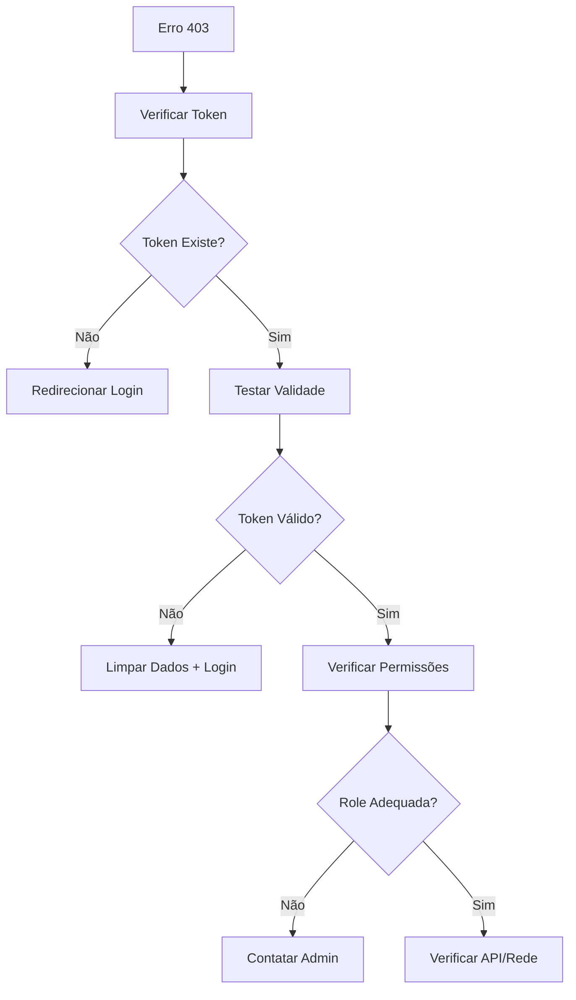

# Troubleshooting 403 Forbidden - Guia Completo

## 🚨 Erro: 403 Forbidden

O erro `403 Forbidden` indica que o servidor entende a requisição, mas se recusa a autorizá-la. Isso geralmente está relacionado a problemas de autenticação ou autorização.

## 🔍 Diagnóstico Rápido

### 1. **Verificar via Interface (Monitor Page)**
Na página Monitor, use os botões de debug:
- **"Testar Token"** - Verifica se o token está válido
- **"Forçar Logout"** - Limpa dados e força nova autenticação

### 2. **Verificar via Console do Navegador**
```javascript
// Verificar se existe token
console.log('Token:', localStorage.getItem('token'));
console.log('Role:', localStorage.getItem('role'));

// Testar autenticação
import { debugAuthentication } from './src/api/confg';
debugAuthentication().then(console.log);
```

## 🛠 Possíveis Causas e Soluções

### **Causa 1: Token Ausente ou Inválido**

**Sintomas:**
- Erro 403 em todas as requisições
- localStorage não tem token
- Usuário não está logado

**Solução:**
```javascript
// Limpar dados e fazer login novamente
localStorage.clear();
window.location.href = '/login';
```

### **Causa 2: Token Expirado**

**Sintomas:**
- Funcionava antes, mas parou de funcionar
- Token existe no localStorage
- Erro 403 após período de inatividade

**Solução:**
```javascript
// O sistema detecta automaticamente e redireciona
// Ou force manualmente:
import { forceLogout } from './src/api/confg';
forceLogout();
```

### **Causa 3: Token Malformado**

**Sintomas:**
- Token existe mas não funciona
- Erro de formato no servidor

**Solução:**
```javascript
// Verificar formato do token
const token = localStorage.getItem('token');
console.log('Token length:', token?.length);
console.log('Token format:', token?.split('.').length); // JWT deve ter 3 partes

// Se malformado, limpar
if (!token || token.split('.').length !== 3) {
  localStorage.removeItem('token');
  localStorage.removeItem('role');
}
```

### **Causa 4: Problemas de Autorização (Role)**

**Sintomas:**
- Token válido mas sem permissões
- Acesso negado a recursos específicos

**Solução:**
```javascript
// Verificar role do usuário
const role = localStorage.getItem('role');
console.log('User role:', role);

// Roles esperadas: 'admin', 'user', etc.
```

### **Causa 5: Headers de Autenticação Duplicados**

**Sintomas:**
- Erro intermitente
- Funciona às vezes

**Verificação:**
O sistema já foi corrigido para evitar duplicação de headers. Verifique no Network tab se há:
```
Authorization: Bearer token1, Bearer token2
```

## 🔧 Debug Avançado

### **1. Interceptor de Requisições**
O sistema já inclui logs automáticos:
```
[API Config] 403 Forbidden - Authentication failed
[API Config] Token: Token exists / No token found
[API Config] Request URL: /api/services
```

### **2. Teste Manual da API**
```bash
# Testar com curl (substitua o token)
curl -H "Authorization: Bearer SEU_TOKEN" \
     -H "Content-Type: application/json" \
     https://infra42luanda.duckdns.org/api/services

# Verificar resposta
# 200 = OK
# 401 = Token inválido
# 403 = Token válido mas sem permissão
```

### **3. Verificar Network Tab**
No DevTools do navegador:
1. Abra Network tab
2. Tente fazer uma requisição
3. Verifique:
   - **Request Headers**: `Authorization: Bearer ...`
   - **Response**: Status code e mensagem de erro
   - **Response Headers**: Podem conter detalhes do erro

## 🚀 Soluções Automáticas Implementadas

### **1. Auto-detecção de Token Expirado**
```javascript
// O sistema detecta automaticamente e:
// 1. Limpa localStorage
// 2. Redireciona para login
// 3. Mostra logs no console
```

### **2. Interceptor de Resposta**
```javascript
// Intercepta erros 403 e fornece informações de debug
api.interceptors.response.use(response, error => {
  if (error.response?.status === 403) {
    // Logs automáticos de debug
    // Limpeza automática se token expirado
  }
});
```

### **3. Debug de Autenticação**
```javascript
// Função para testar se o token funciona
debugAuthentication() // Retorna status detalhado
```

## 📋 Checklist de Solução

- [ ] **Verificar se o token existe** (`localStorage.getItem('token')`)
- [ ] **Testar token via debug** (botão "Testar Token")
- [ ] **Verificar role do usuário** (`localStorage.getItem('role')`)
- [ ] **Limpar dados e fazer login** (botão "Forçar Logout")
- [ ] **Verificar conectividade da API** (configuração da API)
- [ ] **Testar com URL alternativa** (se problema persistir)

## 🔄 Fluxo de Recuperação



## 🆘 Se Nada Funcionar

1. **Limpar completamente o navegador**:
   ```javascript
   localStorage.clear();
   sessionStorage.clear();
   // Recarregar página
   ```

2. **Testar em aba anônima**

3. **Verificar se o servidor está funcionando**:
   ```bash
   ping infra42luanda.duckdns.org
   ```

4. **Contactar administrador** com informações:
   - URL da API sendo usada
   - Token (primeiros/últimos caracteres)
   - Role do usuário
   - Logs do console

## 📝 Logs Importantes

Procure por estes logs no console:
```
[API Config] 403 Forbidden - Authentication failed
[Auth Debug] Current token: Token exists
[Auth Debug] Token validation failed: ...
[API Config] Token expired or invalid, clearing localStorage
```

Estes logs ajudam a identificar exatamente onde está o problema.
